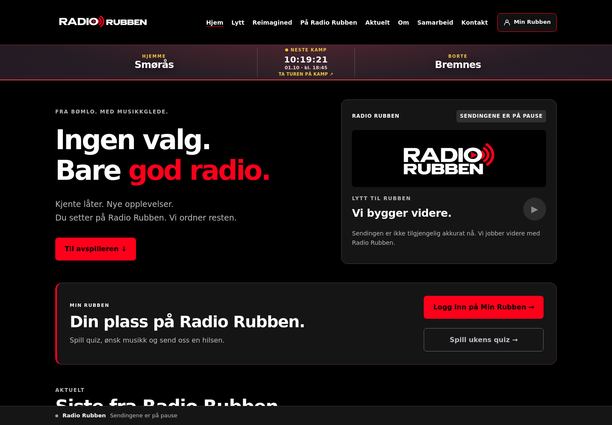
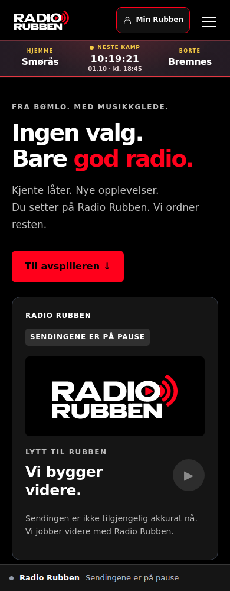

# Nettsideprofil — 1. oktober 2026

Status: klargjort for gjennomgang. Ingen produksjonsfiler eller WordPress-innstillinger er endret.

Grunnlaget er `RadioRubben-Profileringshandbok-v1.0.pdf`, arbeidsutgave 30.09.2026,
og den vedlagte `RadioRubben-Logopakke.zip`. Logo og farger er avklart grunnlag;
Arial og frisone er håndbokens anbefalinger, brukt i dette forslaget.

## Endringen

| Flate | Fil / behandling |
| --- | --- |
| Header over 1100 px | `SVG/11-Liggende-transparent.svg` |
| Header til og med 1100 px | `SVG/07-Uten-verdilinje-hvit.svg` |
| Spiller og bunntekst | `SVG/07-Uten-verdilinje-hvit.svg` |
| Verdilinje | Lesbar HTML i eksisterende bunntekst, uten dobbel liten tekst i logoen |
| Nettstedikon | Originale `Ikoner/ikon-16.png` til `ikon-512.png`, valgt etter størrelse |
| Profilfarge | #FF001B, #000000 og #FFFFFF; nøytrale grå støtteflater |
| Støtteskrift | Arial, Helvetica, system-ui, sans-serif |

Originale SVG- og PNG-filer er kopiert byte for byte med opprinnelige navn.
`assets/brand/2026-09-30/SOURCE.json` dokumenterer kildepakken og SHA-256.
Ingen nytegning, beskjæring, skygge eller forvrengning av logoen.
Gule kampmarkeringer og klubb-/sponsorlogoer beholder sin separate funksjon.
Det gjøres ingen endring av sendingens LIVE/pause-status.

Svart tekst på profilrødt har omtrent 5,28:1 kontrast. Hvitt på samme rødfarge
har omtrent 3,98:1 og brukes derfor ikke som liten knappetekst.
Tilpasset logo og nettstedikon beholdes i databasen. Valget «Bruk Radio Rubbens
logopakke fra 30.09.2026» under Utseende → Tilpass → Nettstedsidentitet kan slås
av for å vise de lagrede logoene/ikonet igjen. Dette valget gjelder logo/ikon,
ikke hele farge- og typografioppdateringen.

## Forhåndsvisning og kontroll

Skjermbildene viser One-forsiden. Next-porteringen bruker samme ressurser og CSS,
men må fortsatt prøves i ekte Next-staging sammen med de øvrige PR #28-portene.

Bildene viser et lokalt, statisk opptak av offentlig forside-HTML og CSS lest
01.10.2026 med profilforslaget lagt til. Eksterne skript og nettverk er blokkert;
kampnedtellingen er et øyeblikksbilde. Dette er en visuell forhåndsvisning,
ikke et nytt WordPress-stagingbevis. Fotoressurser er ikke hentet i denne testen.

- Chromium: 320, 390, 768 og 1440 px. Ingen vannrett overflyt; riktig logovariant
  og bevart størrelsesforhold ved alle fire bredder.
- Header, spiller og bunntekst kontrollert visuelt. Arial, svart hovedflate,
  korrekt knappetekst og profilrød bakgrunn bekreftet i beregnede CSS-verdier.
- Åtte originalfiler verifisert mot SHA-256. SVG-ene har kun statiske konturer.
- De åtte berørte PHP-filene i One/Next er parsersjekket lokalt.
- Ekte PHP-syntakskontroll og repositoryets øvrige kontroller kjøres i GitHub Actions.
- Faktisk WordPress-staging med eksisterende tilpasset logo, nettstedikon,
  cache og innlogget visning gjenstår før publisering.

## Avgrenset utrulling

Aktivt theme er Radio Rubben One 1.3.6. GitHub main bygger på en eldre import,
og eksisterende WPVibe-utkast er eldre enn produksjonen. Ikke publiser hele
main eller hele WPVibe-utkastet for å få inn denne profilendringen.

1. Sammenlign ferske aktive `functions.php` og `header.php` med PR-diffen.
2. Legg inn de tre små tilleggene i `functions.php` (require, stilark,
   profilvalg i logo-hjelperen) og bytt bare logoens img-element i `header.php`.
   Bevar alle andre, nyere serverendringer. Overfør de nye profilfilene samtidig.
3. Kontroller i WordPress-staging at logoer/ikoner lastes, at menyen virker på
   mobil, og at av/på-valget gjenoppretter tidligere tilpassede logoer/ikoner.
4. Ta fersk backup, få visuell sluttgodkjenning, publiser bare denne endringen,
   og tøm side-/CSS-cache. Kontroller forsiden, artikkel, quiz og dagens kamp.

Endringen trenger ingen databaseoppdatering, ny plugin eller endret deployoppsett.
Tilbakeføring: gjenopprett de to PHP-filene fra backup; de nye ressursene kan
ligge ubrukt. Nytt theme i PR #28 får tilsvarende profil separat, men beholder
alle sine eksisterende manuelle aktiveringsporter.

## Profilmaster og OneDrive

Håndbokens foreslåtte plassering er
`Radio Rubben / Sosiale Medier / Profil og logo / 2026`.
GitHub inneholder nettressursene og kildehashene. Ingen OneDrive-filer er flyttet
eller endret, og ingen faktisk OneDrive-lenke er bekreftet i denne oppgaven.
